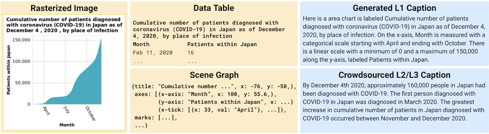

# VisText: A Benchmark for Semantically Rich Chart Captioning


VisText is a benchmark dataset of over 12,000 charts and semantically rich captions! In the VisText dataset, each chart is represented as its rasterized image, scene graph specification, and underlying datatable. Each chart is paired with a synthetic L1 caption that describes the chart's elemental and ecoded properties and a human-generated L2/L3 caption that describes trends and statistics about the chart.

In the VisText paper, we train text-based models (i.e, models that use the scene graph and data table chart representations) as well as image-guided models that include the chart image. We also include semantic prefix-tuning, allowing our models to customize the level of semantic content in the chat. Our models output verbose chart captions that contain varying levels of semantic content.

This repository contains code for training and evaluating the VisText models. For more info, see: [VisText: A Benchmark for Semantically Rich Chart Captioning (ACL 2023)](https://vis.csail.mit.edu/vistext/)

## Repository Structure
```
run.sh # Main script used to train and evaluate models

./code # Dataset generation, training, and evaluation code
    image_guided/ # image-guided models use chart images
    text_only/ # text_only models use chart scene graphs and data tables
    ...
    
./data # Stores the VisText dataset
    feature_extraction/ # Code to extract chart visual features
    ...

./metrics # Default directory prediction metrics will be written to
    
./models # Stores model outputs and pretrained model checkpoints
```

## Set Up
### 克隆 VisText 仓库 & 准备环境
克隆 VisText 仓库 `git clone https://github.com/mitvis/vistext.git`。
为了建立 `conda` 环境，运行 `conda env create -f environment.yml` (evaluation and text-only training) 和 `conda env create -f environment-image_guided.yml` (image-guided models)。
This will create the `conda` environments with the correct package versions, which you can activate with `conda activate vistext` and `conda activate vistext-image_guided` respectively.

### 下载原始数据
调用 `download_data.sh` 脚本以下载并解压原始数据（以及可选的图像引导特征和模型权重）。默认情况下，脚本会下载表格（tabular）数据文件（包含精简场景图的分割数据、线性化数据表和caption）。可选参数如下：
```
--images                 # Download rasterized image files
--scenegraphs            # Download original/hierarchical scene graph files
--vl_spec                # Download Vega-Lite specs
--image_guided           # Download visual features and the weights for VLT5/VLBart necessary for fine-tuning
```
要仅下载 text-based captioning 所需的数据分割，运行：
```
bash download_data.sh
```
要下载所有数据，运行：
```
bash download_data.sh --images --scenegraphs
```

> 注：在 git bash 运行

<!-- Download the raw data from the [dataset site](http://vis.csail.mit.edu/) and unzip to `data/`.
Ensure that you have three folders, `data/images`, `data/scenegraphs`, and `data/features`. -->

### Generate the VisText dataset from raw data
Run the `code/dataset_generation.ipynb` notebook from start to finish, which will generate the three split dataset files `data/data_train.json`, `data/data_test.json`, and `data/data_validation.json`.

<!-- ### Download pretained model checkpoints [image-guided only]
For image-guided models, we finetune the pretrained checkpoints from [VLT5](https://arxiv.org/abs/2102.02779). Download the `pretrain` folder from the [VLT5 Google Drive](https://drive.google.com/drive/folders/1wLdUVd0zYFsrF0LQvAUCy5TnTGDW48Fo?usp=share_link) and add it to the `models` folder. -->

## Usage
### Model training, evaluation, and predictions
Call `run.sh` with your desired parameters. Options are:
```
-c model_class           # Class of models to use ('text_only' or 'image_guided').
-b batch_size            # Batch size for training, validation, and testing.
-e num_epochs            # Number of epochs to train for.
-g num_gpus              # Number of gpus to parallelize across.
-i input_type            # Chart text representation ('scenegraph', 'datatable', or 'imageonly').
-m model_backbone        # Model architecture to finetune ('byt5', 't5', or 'bart').
-s seed                  # Seed number.
--prefix_tuning          # Flag to use sematic prefix-tuning.
```
For example, to train and evaluate the `scene-graph` model with prefix-tuning, run:
```
bash run.sh -c text_only -b 4 -e 50 -g 4 -i scenegraph -m byt5 -s 10 --prefix_tuning
```
If you are training image guided models, be sure to use the correct `conda` environment (`vistext-image_guided`).

### Evaluating on test set
Call `run_test.sh` with your parameters. Options are:
```
-p predictions_path      # Path of predictions
-f results_filename      # Filename to save results under in metrics/
--split_eval             # Flag to use for evaluating L1 and L2/L3 captions separately; only works with prefix-tuning models.
--prefix_tuning          # Flag to use sematic prefix-tuning.
```

For example, to run evaluation on the above trained model, run:
```
bash run_test.sh -p models/vistext_scenegraph_byt5_prefixtuningtrue_seed10/generated_predictions.txt -f vistext_scenegraph_byt5_prefixtuningtrue_seed10.txt --split_eval --prefix_tuning
```

## Mapping from Statista Dataset
VisText 使用了 Statista 数据集，来自 [Chart-to-Text: A Large-Scale Benchmark for Chart Summarization](https://github.com/vis-nlp/Chart-to-text)。本工作的 ID 映射关系在 `data/statista_mappings.json` 中。

## Language Prompts
The models we trained on VisText, including the [open-source pretrained VisText models](https://vis.csail.mit.edu/vistext/), use the prompt structure: `translate chart to {semantic level}:  `. For each training variation the prompt is:
* Full caption generation: `translate chart to L1L2L3:  `
* Prefix-tuning L1 generation: `translate chart to L1:  `
* Prefix-tuning L2/L3 generation: `translate chart to L2L3:  `


## Citation
For more information about VisText, check out [VisText: A Benchmark for Semantically Rich Chart Captioning](https://vis.csail.mit.edu/vistext/)
```
@inproceedings{2023-vistext,
  title = {{VisText: A Benchmark for Semantically Rich Chart Captioning}},
  author = {Benny J. Tang AND Angie Boggust AND Arvind Satyanarayan},
  booktitle = {The Annual Meeting of the Association for Computational Linguistics (ACL)},
  year = {2023},
  url = {http://vis.csail.mit.edu/pubs/vistext}
}
```
